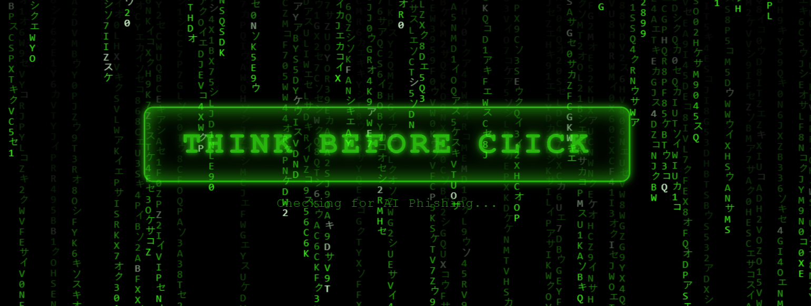
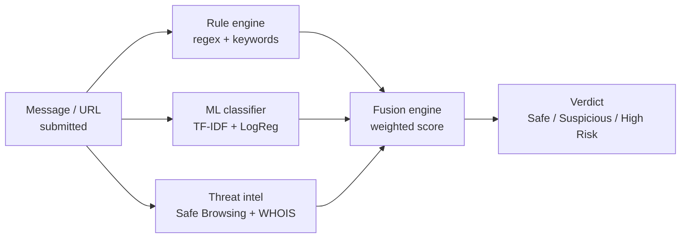
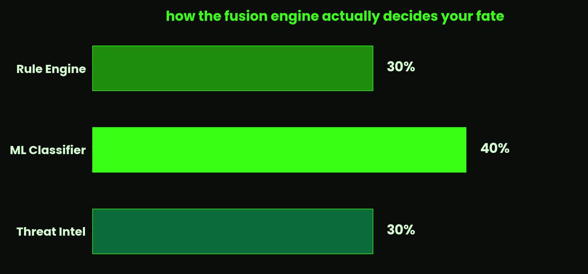

<div align="center">
  
</div>

<div align="center">

**Congratulations — you're one click away from finding out.**
Good thing you scrolled here first instead of clicking there first.
This is the part of the internet that actually tells you *why* something smells wrong.

</div>

<div align="center">

[](https://thinkbeforeclick.me)
[](https://thinkbeforeclick.onrender.com/health)
[]()
[]()

</div>

---

## What is this, actually

Students receive roughly one (1) legitimate scholarship email per lifetime, and forty (40)
increasingly well-written scams per semester claiming to be that email. **ThinkBeforeClick**
is the tool that reads them before you do, and — unlike your gut feeling at 1am — actually
explains its reasoning instead of just vibing.

Paste a message. Paste a link. Get a verdict, a confidence score, and a plain-language
explanation of exactly which red flags fired. No accounts, no login, no data kept unless
you explicitly ask us to remember your mistake for science.

## How it decides you're about to get scammed

Three independent detection layers argue with each other, and a fusion engine settles it
like a judge who's seen this exact case 40,000 times before.



<div align="center">
  
</div>

The ML layer gets the deciding vote because keyword lists are what scammers learned to
dodge around a decade ago. A confirmed Google Safe Browsing hit overrides all of this
anyway, because when Google says "this is malware," democracy is suspended.

## The stack, and what it's guilty of

| Layer | Technology | What it actually does here |
|---|---|---|
| API | **FastAPI** + Uvicorn | Serves `/analyze`, validates every request so garbage in doesn't mean garbage out |
| Detection | **Python regex** | Catches the scams that still shout "URGENT!!!" in 2026, bless them |
| Detection | **scikit-learn** (TF-IDF + Logistic Regression) | Catches the scams that learned not to shout |
| Detection | **Google Safe Browsing v4 + WHOIS** | Catches the scams with a domain registered eleven minutes ago |
| Storage | **SQLite** + SQLAlchemy | Remembers scans, forgets you, by design |
| Frontend | Plain **HTML / CSS / JS** + Canvas + GSAP | Matrix rain, because a plain textbox has never scared anyone into good judgment |
| Hosting | **Render** + custom domain | Where all of this actually lives, 24/7, mostly awake |

## What it's caught so far

- Obvious phishing ("URGENT, account suspended, click now") — **High Risk**, correctly,
  every single time, because subtlety was never these scammers' strong suit
- Google's own official malware test URL — **High Risk**, because failing that one
  particular test would have been genuinely embarrassing
- A normal message about lunch plans — **Safe**, no bullet-point interrogation, because
  not everything is a crime

It has also, notably, occasionally let a *very* polite scam through Suspicious instead of
High Risk — which is less a bug and more a reminder that manners are apparently a valid
social engineering tactic.

## Try it yourself

Live at **[thinkbeforeclick.me](https://thinkbeforeclick.me)** — no signup, no download,
no reason not to.

## Roadmap (a.k.a. things not yet done, stated plainly)

- [x] Rule-based detection
- [x] ML classifier
- [x] Threat-intelligence layer
- [x] Fusion engine
- [x] Web app, deployed, with a custom domain and everything
- [ ] Browser extension — because copy-pasting into a website is *one* step too many for
      the people this is built for
- [ ] Retrained model with a broader, more diverse dataset — currently in progress

## Build it yourself, if you must

```bash
git clone https://github.com/Priyanshu794/ThinkBeforeClick.git
cd ThinkBeforeClick/backend
pip install -r requirements.txt
uvicorn app.main:app --reload
```

Then open `webapp/index.html` however you like your static files served. Yes, you need a
`SAFE_BROWSING_API_KEY` in a `.env` file. No, we're not giving you ours.

---

<div align="center">

*Built by a student, for students who'd rather not learn threat modeling the expensive way.*

</div>
